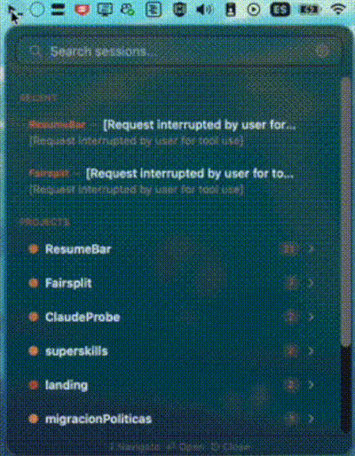
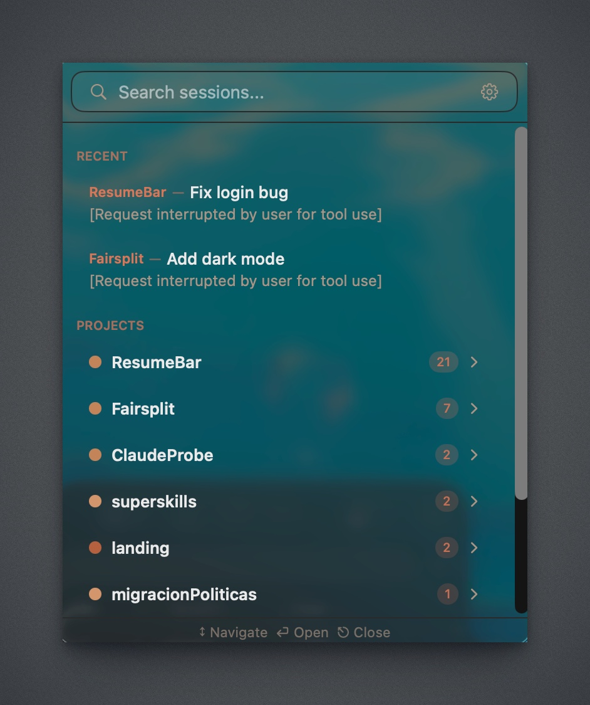
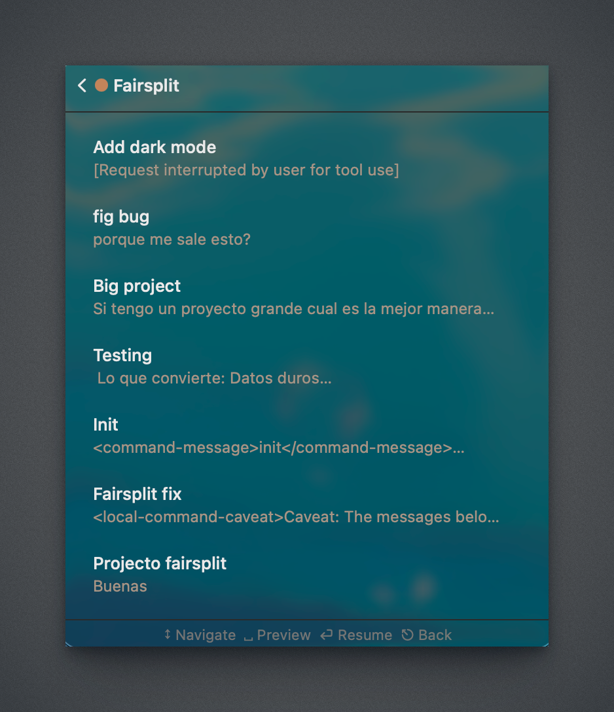

# ResumeBar

[](https://github.com/crlian/ResumeBar/releases)
[](LICENSE)
[](https://github.com/crlian/ResumeBar)
[](https://github.com/crlian/ResumeBar/stargazers)

Resume any Claude Code session in one click from your menu bar.



> **Early preview** — This project is a couple of days old. Expect bugs, rough edges, and things that don't quite work yet. Feedback and PRs welcome!

## Why

If you use Claude Code daily, resuming old sessions is painful. You have to remember session IDs, dig through terminal history, or navigate `.claude/projects/` manually.

ResumeBar puts all your sessions one click away:

- **Open from menu bar** — always accessible, never in your way
- **Find by project** — sessions grouped and searchable by project name
- **Resume instantly** — opens your terminal and runs `claude --resume` for you

## Features

- **Menu bar app** — lives in your macOS menu bar, zero window management
- **Project browser** — all Claude Code projects with session counts and last activity
- **Session list** — sorted by recency, with first-message preview
- **Chat preview** — drill into any session to read the full conversation
- **Search** — filter projects and sessions as you type
- **Pin sessions** — keep your most important sessions at the top
- **Rename sessions** — give sessions meaningful names instead of cryptic first messages
- **One-click resume** — launches `claude --resume <session-id>` in your terminal
- **Terminal support** — works with Terminal, iTerm2, Ghostty, and Warp
- **Auto-refresh** — watches `~/.claude/projects/` for changes via file system events
- **Settings** — configure terminal app, recent session count, refresh interval

## Roadmap

- **Auto-naming** — use Claude to automatically generate descriptive names for each session based on the conversation content
- Your ideas? [Open an issue](../../issues)

## Screenshots

<p>
  
  
</p>

## Installation

### Download

Grab the latest `.zip` from [GitHub Releases](../../releases) and drag `ResumeBar.app` to your Applications folder.

> **Note:** Since the app is not notarized yet, you'll need to right-click → Open the first time.

### Build from source

Requires Xcode 26+ and macOS 26+.

```bash
git clone https://github.com/crlian/ResumeBar.git
cd ResumeBar
open ResumeBar.xcodeproj
```

Build and run with `Cmd+R`.

## How it works

ResumeBar reads Claude Code session files from:

```
~/.claude/projects/<project-path>/<session-id>.jsonl
```

It parses each `.jsonl` file to extract the first user message as the session title, groups sessions by project, and watches the directory for new sessions.

When you click Resume, it opens a new terminal window, `cd`s to the project directory, and runs `claude --resume <session-id>`.

## Requirements

- macOS 26 or later
- [Claude Code](https://docs.anthropic.com/en/docs/claude-code) installed

## Contributing

See [CONTRIBUTING.md](CONTRIBUTING.md) for guidelines.

## License

MIT

---

Not affiliated with Anthropic.
